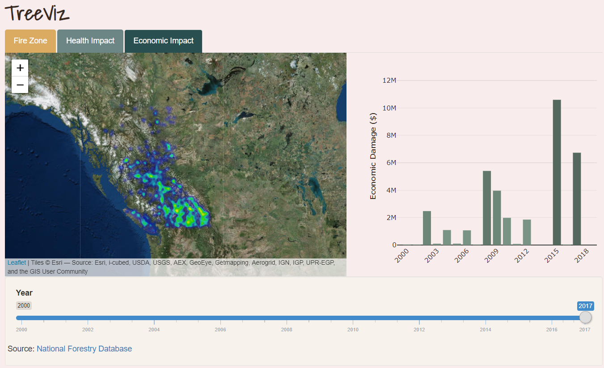

# Girls In Tech - TreeViz

### Contributors: Bailey Lei, Alex Pak, Sabrina Tse, June Wu
### Date: May 5, 2019

TreeViz explores different visualizations and impact of climate change, to educate and motivate the future generation.

The TreeViz app can be found online at https://pakalexh.shinyapps.io/TreeViz/.

## Inspiration

We were inspired to make education on climate change more effective by helping educators to understand what motivates their students and thus align their area of interest with the teaching materials. We know that climate change will have a large impact on the future generation, so by making increasing awareness of the urgency of climate change, they will be more likely to take action.

Currently, there is an abundance of information readily available on climate change, but a tool to gauge the effectiveness of the educational materials has not yet been developed. So we created TreeViz with two main uses in mind:

1) Help highschoolers to better understand the impacts of climate changes through data visualization and quizzes.

2) Help school boards and teachers to improve education on climate change by focusing on what motivates their students.

## How we built it
TreeViz includes a data visualization application in R Shiny App and quizzes built using Java.

On the TreeViz interface, students learn about the intensity, location of the forest fires happened in BC in the past, and how it progressed throughout the years. Instead of providing forecasting visualization on how the next 10 years will look like, TreeViz focuses more relevant and simple context. It comes in different subjects; students will learn about the impact of climate change on health, local communities and on animals. In addition, students have the option to take quizzes to strengthen their understanding of the topic.

At the back-end, TreeViz collects the interaction data from students and perform statistical analyses such as A/B testing to determine which topics within climate change students care about the most. This information is powerful because educators can customize their teaching methods to achieve more effective learning, based on the fact that the more relatable the content is to you, the more likely you will listen and take actions.

## Data we used:

Currently, we only focus on the BC data because it is the most relevant to us who live here. But we believe that our
app is highly flexible that we can include more national data, more topics or even apply it in different industries.

Data sources:

[BC Forest Fire Statistics] (https://catalogue.data.gov.bc.ca/dataset/fire-incident-locations-historical#edc-pow)
[BC ecohomical impact of climate change](http://nfdp.ccfm.org/en/data/fires.php)

## What's next for TreeViz

We believe that our app is highly flexible that we can include more national data, more topics or even apply it in different industries.
